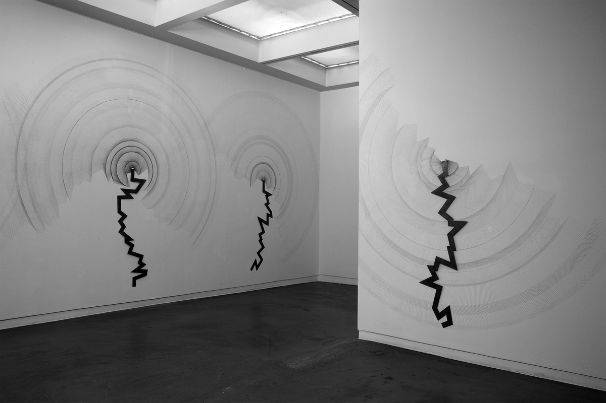
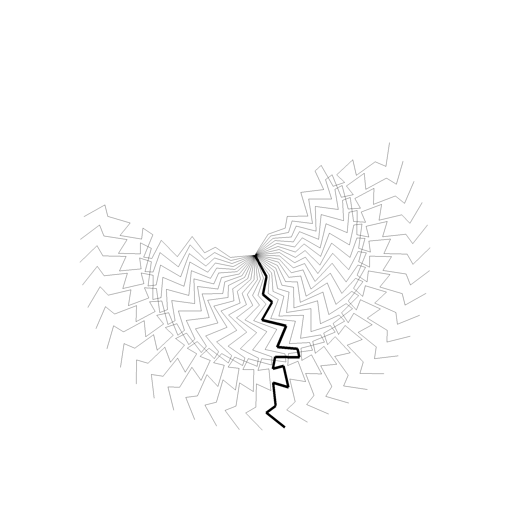
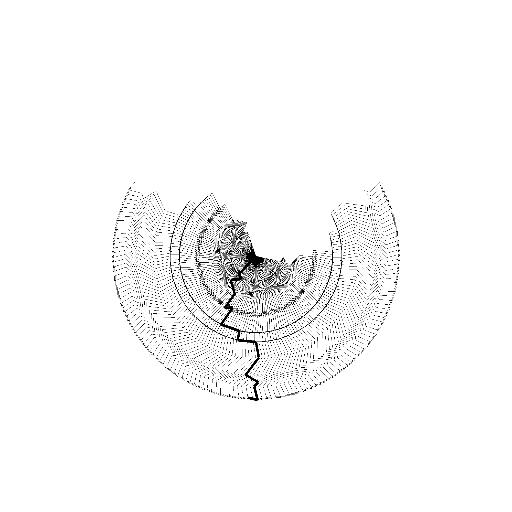

# Vertical Earthquake
Vertical Earthquake is an art installation from the Mexican artist Carlos Amorales. It consists of a crooked metal ruler, which is used to draw pencil lines to form semi circles made by the repetition of the zigzag patterns. 

_Source: http://estudioamorales.com/vertical-earthquake-germinal/_

The code in this repository creates similar earthquake patterns. The metal ruler is represented by a thick line, and the pencil lines are represented by much thinner lines. The algorithm is designed such that the zigzag lines are visually pleasing. The user of this code can play around with the constants for different results. Below two example drawings with 16 and 64 mirror lines respecitvely.

Running the code requires Python 3.6 or up.
